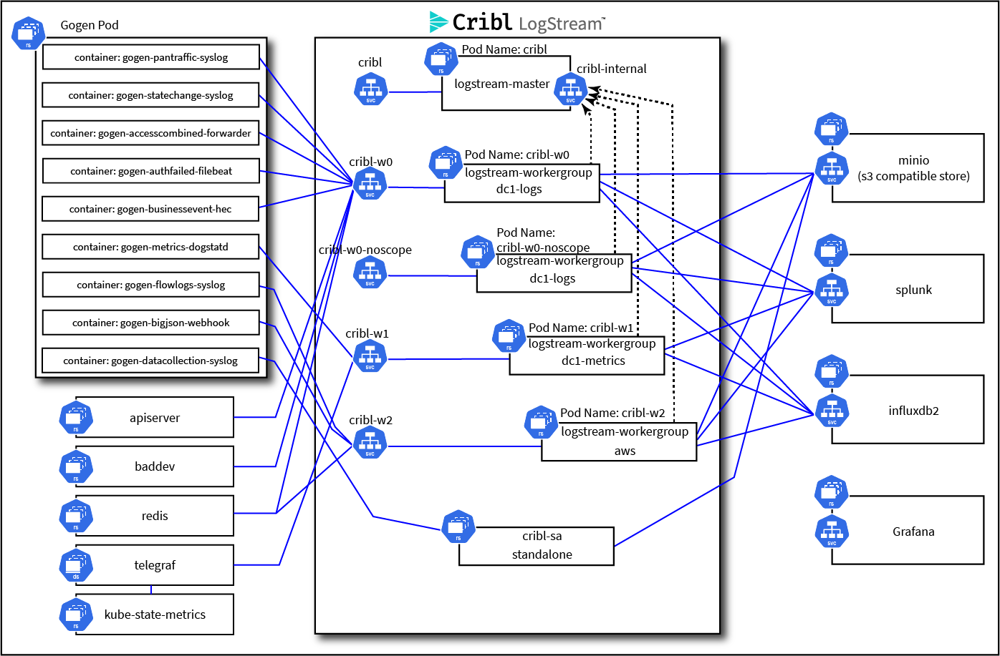

# Changes to the Demo Environment

## Feb 5, 2021

### Structural Changes

* Moved cribl-demo to only run on Kubernetes, retiring the docker-compose framework, as well as the env-builder based mastering of the repo. 
* Worker Group Changes - To show that worker group definition is somewhat arbitrary, based on the needs of the customer, and not necessarily based on any functional best practice.

	* Renamed worker groups:

      |Old|New|
      |---|---|
      |logs|dc1-logs|
      |metrics|dc1-metrics|

    * Introduced new worker group: aws, and moved the Trim Big JSON demo flow to it.
    
* Added vpcflow logs data, collector and pipeline to the aws worker group. This also includes a redis lookup of aws account id to name, and the pipeline is modeled after the firewall_geoip_enrich pipeline in dc1-logs, implying that you can use logstream to unify two disparate types of log data (PAN firewall + VPC flowlogs)

* Replaced old demo redis_lookup function in enrich pipeline with the new (2.4+) redis function.

* Created a new branch `docker-legacy` to support people transitioning from the docker-compose based flow to the kubernetes flow, which will be present until 4/1/2021 as a "transition period"

* Cleanup and bug fixes as requested by the SE team and others.

# Topology

