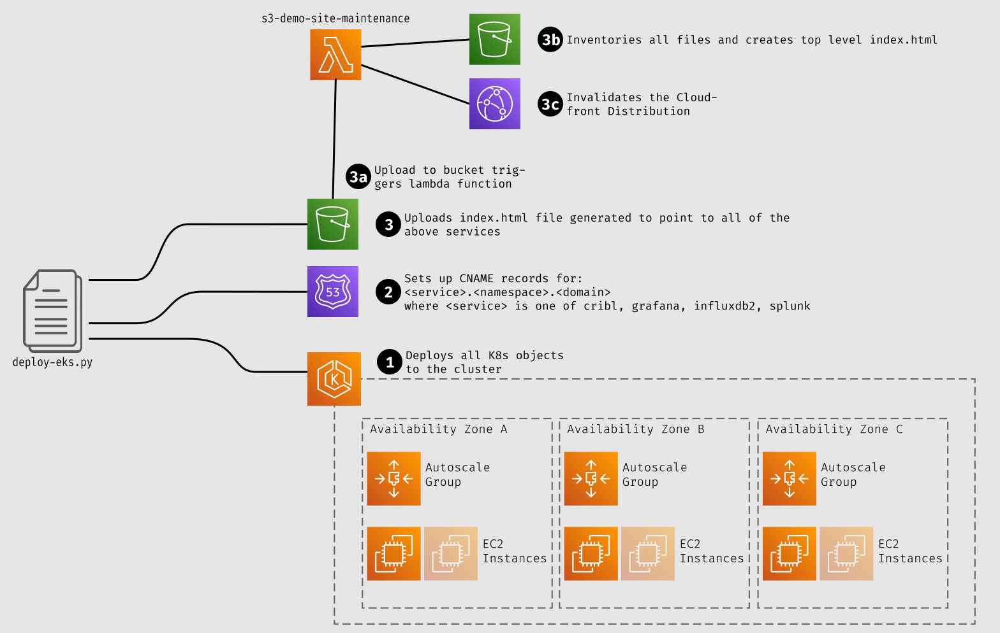
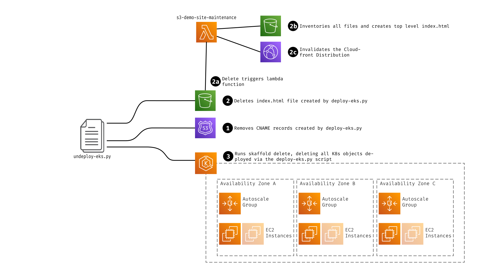

This demo environment uses Kubernetes. To run this locally, we recommend minikube. Additionally, this environment uses `skaffold` to orchestrate building the requisite containers and deploying into Kubernetes. On a Mac with homebrew:

    brew install minikube
    brew install skaffold
    brew install kubectl
    brew install helm

On Linux:

    curl -Lo skaffold https://storage.googleapis.com/skaffold/releases/latest/skaffold-linux-amd64 && \
    sudo install skaffold /usr/local/bin/ && \
    rm ./skaffold

    curl -LO https://storage.googleapis.com/kubernetes-release/release/$(curl -s https://storage.googleapis.com/kubernetes-release/release/stable.txt)/bin/linux/amd64/kubectl \
    && sudo install kubectl /usr/local/bin && rm kubectl

    curl https://baltocdn.com/helm/signing.asc | sudo apt-key add - && \
    sudo apt-get install apt-transport-https --yes && \
    echo "deb https://baltocdn.com/helm/stable/debian/ all main" | sudo tee /etc/apt/sources.list.d/helm-stable-debian.list && \
    sudo apt-get update && \
    sudo apt-get install helm

    curl https://raw.githubusercontent.com/helm/helm/master/scripts/get-helm-3 | bash

    curl -fsSL https://download.docker.com/linux/ubuntu/gpg | sudo apt-key add - && \
    sudo add-apt-repository "deb [arch=amd64] https://download.docker.com/linux/ubuntu focal stable" && \
    sudo apt update && \
    sudo apt install docker-ce && \
    sudo usermod -aG docker ${USER}

    curl -LO https://storage.googleapis.com/minikube/releases/latest/minikube-linux-amd64 \
    && sudo install minikube-linux-amd64 /usr/local/bin/minikube && rm minikube-linux-amd64


If you don't have homebrew, check out the following links for install instructions:
    * Minikube: https://minikube.sigs.k8s.io/docs/start/
    * Skaffold: https://skaffold.dev/docs/install/

To run the demo LOCALLY on minikube (again, on a Mac):

    ./start.sh local
    skaffold dev --port-forward=true -p dev

If you already have minikube running, you can omit the "local" argument to `start.sh`. The `-p dev` argument to skaffold invokes the "dev" profile, which uses kube-proxy redirection for service deployment. If that's omitted, the services for cribl, splunk and grafana will all attempt to create load balancers.

Now, you can access Cribl at http://localhost:9000 with username `admin` password `cribldemo`. 

# Running on EKS
Running in "Production" mode on an EKS cluster requires a few additional steps.

## Pre-Requisites for Deployment Scripts

```
pip -r ./requirements.txt
```
additionally, you'll need to have active AWS credentials in the shell.


## Deploy-Eks

Running in EKS requires that you push the docker images up into ECR. ECR's repository structure requires that you pre-create the repos for each image. The script `deploy-eks.py` will create the ECR repos and build and deploy to your EKS cluster. You will need to run pip on the requirements.txt file, like this:


### Running
You can run the `deploy-eks.py` script, as follows:

```
./deploy-eks.py -c <repo head> [-d <domain default:demo.cribl.io>] [-n <namespace default:default>] [-r <region default:us-west-2>] [-a <description default:Demo Environment>] [-p <profile>]
```

or if you're using V2 of the AWS CLI, invoke it as follows:
```
aws2-wrap --profile <AWS Profile> --exec "./deploy-eks.py -c <repo head> [-d <domain default:demo.cribl.io>] [-n <namespace default:default>] [-r <region default:us-west-2>] [-a <description default:Demo Environment>] [-p <profile>]"
```

## Undeploy-EKS


This script is the comprehensive way to "undeploy" an environment deployed with deploy-eks.py - it will not only run skaffold delete, but will also remove the CNAME entries from the route53 domain, and remove the index file from s3.

### Running

Options for `undeploy-eks.py` are a subset of the options for `deploy-eks.py`

```
./undeploy-eks.py -c <repo head> [-d <domain default:demo.cribl.io>] [-n <namespace default:default>] [-r <region default:us-west-2>]
```

or if you're using V2 of the AWS CLI, invoke it as follows:
```
aws2-wrap --profile <AWS Profile> --exec "./undeploy-eks.py -c <repo head> [-d <domain default:demo.cribl.io>] [-n <namespace default:default>] [-r <region default:us-west-2>]"

## Arguments
* -c \<repo head\> - the name to use as the "directory" in the ECR repo structure - each image will end up as \<repo head\>/\<image name\>:\<tag\>
* -d \<domain\> - the domain to use - this will be looked up in Route53 - it defaults to demo.cribl.io. The domain must be a domain that is manageable from the account this is being run in. This will also be used in reverse notation (i.e. demo.cribl.io becomes io.cribl.demo) for the bucket name to upload the index files to.
* -n \<namespace\> - the k8s namespace that it should be deployed into. This defaults to "default", but it's recommended to use a separate namespace for each environment.
* -r \<region\> - the AWS region to deploy into.
* -a \<description\> - the description of the environment for the index page that gets generated. This can be html format (only available in `deploy-eks.py`).
-p \<profile\> - the skaffold profile to use (only available in `deploy-eks.py`)